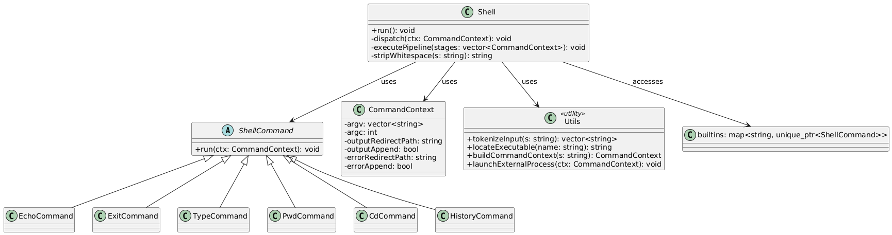

# C++ Shell

A minimal Unix shell implemented in **C++**, featuring command execution, piping, command history, tab completion, output redirection, arrow key navigation, and several built-in commands.

---

## Features

- **Built-in Commands**:
  - `cd`, `pwd`, `exit`, `echo`, `type`, `history`

- **External Commands**:
  - Executes any binary available in your system’s `$PATH`, such as:
    `ls`, `cat`, `grep`, `mkdir`, `touch`, `rm`, `pwd`, `tail`, etc.

- **Piping**:
  - Full support for the `|` operator  
    _Example_: `ls | grep txt`

- **Redirection**:
  - `>` — overwrite stdout  
  - `>>` — append stdout  
  - `2>` — overwrite stderr  
  - `2>>` — append stderr

- **Quote-aware Parser**:
  - Properly handles `'single'`, `"double"` quotes, and escaped `\` characters

- **Command History**:
  - Persistent history using `HISTFILE`
  - Options:
    - `history -r <file>` — read from file
    - `history -w <file>` — write to file
    - `history -a <file>` — append session history

- **Arrow Key Navigation**:
  - Navigate and reuse previous commands using arrow keys

- **Auto-completion**:
  - Tab-completion for built-in commands and executables using `readline`

---

## How to Build

Make sure required dependencies are installed, then build and run the project:

```sh

chmod +x buildProject.sh
./buildProject.sh
./build/shell
```

---

## Example Session

```sh
$ echo Hello World
Hello World

$ cd /tmp
$ pwd
/tmp

$ ls | grep log > logs.txt
$ history
   1  echo Hello World
   2  cd /tmp
   3  pwd
   4  ls | grep log > logs.txt
   5  history
```

---

## Architecture Overview

| File(s)                        | Description                                              |
|-------------------------------|----------------------------------------------------------|
| `main.cpp`                    | Program entry point and history management               |
| `shell.cpp`, `shell.hpp`     | REPL loop, command pipeline execution, tab-completion    |
| `utils.cpp`, `utils.hpp`     | Tokenization, `$PATH` search, external command handling  |
| `builtins.cpp`, `builtins.hpp` | Implementation of built-in commands (`cd`, `pwd`, etc.) |

---

## Class Diagram (PlantUML)


